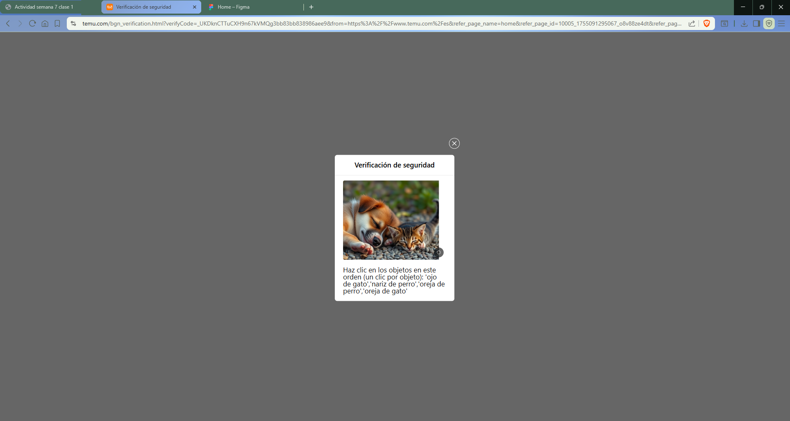

# Actividad-Semana-7-Clase-1

# Análisis TEMU:

El logo se ubica arriba a la izquierda, algo pequeño pero fácil de acceder ya que no hay que subir del todo antes de que vuelva a aparecer. Al hacer click en él, nos lleva al inicio. 

El buscador se encuentra centrado al tope de la página, y al igual que el logo, al subir vuelve a aparecer enseguida si es que scrolleamos bastante para abajo.

El ícono del carrito está siempre presente en la misma barra que el ícono del sitio y el buscador. También es algo pequeño, quizás alguien que nunca haya usado un e-commerce tiene problemas encontrándolo. 

El perfil del usuario aparece a la derecha del buscador, a menos que no hayas iniciado sesión, lugar desde donde también se puede entrar. 

Los menús utilizados son dos. El principal es uno horizontal y bastante simple de navegar, pero una opción dentro tiene un mega menú enorme: la sección de categorías. 

En la página principal, las imágenes de los productos se ubican de a montones, en una cuadrilla. Sus descripciones saltan cuando pasamos por encima de la imagen del producto (al hacer hover), en un texto que parece un poco chico. A su vez, algunos productos muestran un video al posicionar el mouse arriba. El precio aparece debajo de la imagen, y se puede añadir el producto al carrito con el botón que aparece a la derecha (del precio).

## Comentarios: 
El diseño no está tan mal, pero tiene algunas trabas. La sección de ofertas muestra productos, pero al querer ir a dicho producto te lleva a otra página con otros productos. MAL. También, al entrar por primera vez a la página y cada tanto mientras navegábamos, saltaban captchas que entorpecen enormemente el proceso de realizar una compra. Tenemos aquí la prueba:

